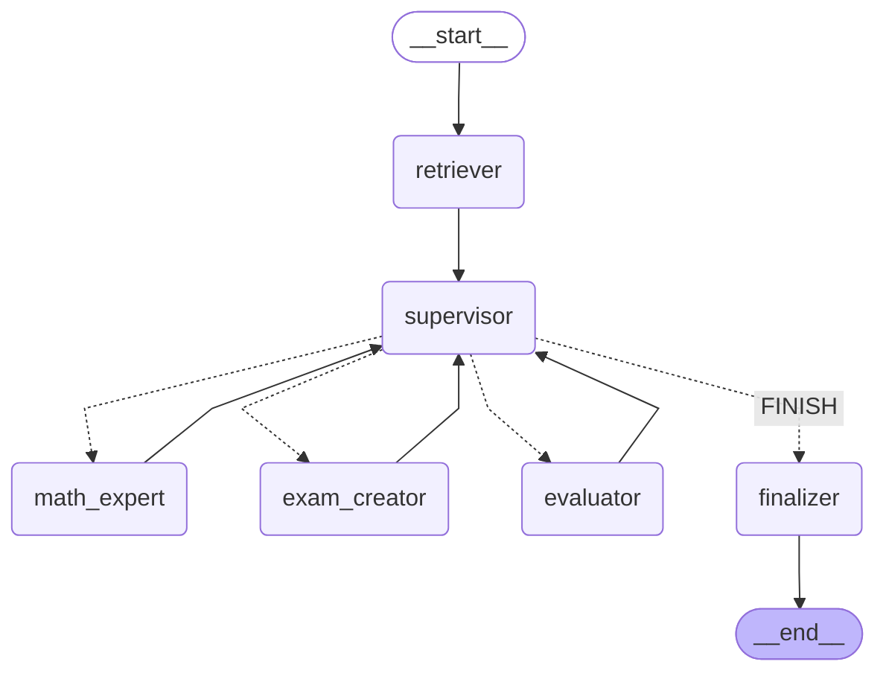

# Grafo del Pipeline de Agentes

```mermaid
---
config:
  flowchart:
    curve: linear
---
graph TD;
	__start__([<p>__start__</p>]):::first
	retriever(retriever)
	supervisor(supervisor)
	math_expert(math_expert)
	exam_creator(exam_creator)
	evaluator(evaluator)
	finalizer(finalizer)
	__end__([<p>__end__</p>]):::last
	__start__ --> retriever;
	evaluator --> supervisor;
	exam_creator --> supervisor;
	math_expert --> supervisor;
	retriever --> supervisor;
	supervisor -.-> evaluator;
	supervisor -.-> exam_creator;
	supervisor -. &nbsp;FINISH&nbsp; .-> finalizer;
	supervisor -.-> math_expert;
	finalizer --> __end__;
	classDef default fill:#f2f0ff,line-height:1.2
	classDef first fill-opacity:0
	classDef last fill:#bfb6fc

```